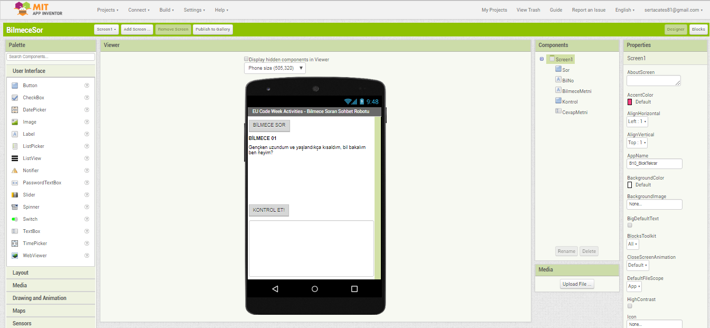

# EUCodeWeek2021
Avrupa Kodlama Haftası kapsamındaki etkinliklerimizde ürettiğimiz çalışmalarımızdır.

## EUCodeWeek2021 - 01
Bu etkinliğimizde Python programlama dilinde tkinter kütüphanesindeki Grafik Arayüz kullanılarak bir sohbet yazılımı hazırlanmıştır. Bilmece soran sohbet robotu oluşturulmuştur.
Gerekli dosyalar:
- EUCW01_bilmeceSoranSohbetRobotu.py
- EUCW01_etkisizKelimeler.txt

## EUCodeWeek2021 - 02
Bu etkinliğimizde https://appinventor.mit.edu/ kullanılarak bir bilmece soran robot oluşturulmuştur.
Yapılacak İşlemler:
- Screen (Ekran) özellikleri değiştirilecektir.
- Label (Etiket) özellikleri değiştirilecektir.
- Button (Düğme) lerin özellikleri değiştirilecektir.
- Text Box (Metin Kutusu) özellikleri değiştirilecektir.
- İsimlendirmeler yapılacaktır.
- İsimlendirmelere ve nesnelere dikkat edilerek blok yapısı oluşturulacaktır.
- Telefonunuza https://play.google.com/store/apps/details?id=edu.mit.appinventor.aicompanion3&hl=tr&gl=US indirdikten sonra aicompanion ile uygulamanızı çalıştırabilirsiniz.

