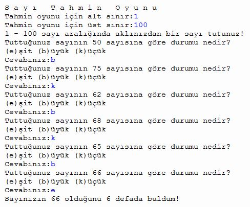
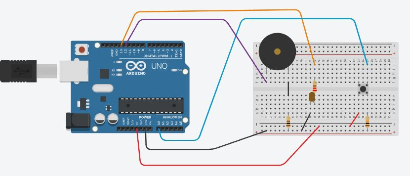

# EUCodeWeek2021
Avrupa Kodlama Haftası kapsamındaki etkinliklerimizde ürettiğimiz çalışmalarımızdır.

## EUCodeWeek2021 - 01
Bu etkinliğimizde Python programlama dilinde tkinter kütüphanesindeki Grafik Arayüz kullanılarak bir sohbet yazılımı hazırlanmıştır. Bilmece soran sohbet robotu oluşturulmuştur.
Gerekli dosyalar:
- EUCW01_bilmeceSoranSohbetRobotu.py
- EUCW01_etkisizKelimeler.txt

Etkinlik bağlantısı: https://codeweek.eu/view/388625/bilmece-soran-sohbet-robotu

## EUCodeWeek2021 - 02
Bu etkinliğimizde https://appinventor.mit.edu/ kullanılarak bir bilmece soran robot oluşturulmuştur.
Yapılacak İşlemler:
- Tek tek nesneler tasarım ekranına eklenecek ve isimlendirmeler yapılacaktır. (EUCW02_00-Tasarım.PNG)
- Screen (Ekran) özellikleri değiştirilecektir. (EUCW02_01-Screen Properties 01.PNG)(EUCW02_01-Screen Properties 02.PNG)
- Label (Etiket) özellikleri değiştirilecektir. (EUCW02_03-Label Properties 01.PNG)
- Button (Düğme) lerin özellikleri değiştirilecektir. (EUCW02_02-Button Properties 01.PNG)(EUCW02_05-Button2 Properties 01.PNG)
- Text Box (Metin Kutularının) özellikleri değiştirilecektir. (EUCW02_04-Text Box Properties 01.PNG)(EUCW02_06-Text Box2 Properties 01.PNG)
- İsimlendirmelere ve nesnelere dikkat edilerek blok yapısı oluşturulacaktır. (EUCW02_07 - Blok Yapısı.PNG)
- Telefonunuza https://play.google.com/store/apps/details?id=edu.mit.appinventor.aicompanion3&hl=tr&gl=US indirdikten sonra aicompanion ile uygulamanızı çalıştırabilirsiniz.

Etkinlik bağlantısı: https://codeweek.eu/view/388670/bilmece-soran-mobil-uygulama

## EUCodeWeek2021 - 03
Bu etkinliğimizde Python programlama dilinde İkili Arama Algoritması kullanılarak bir Sayı Tahmin Oyunu hazırlanmıştır.

Gerekli dosyalar:
- EUCW03_codeweek2021.py

Örnek Girdi ve Çıktılar:

Etkinlik bağlantısı: https://codeweek.eu/view/388730/aklindaki-sayiyi-tahmin-edeyim-mi

## EUCodeWeek2021 - 04
Bu etkinliğimizde TinkerCAD Circuits'ta buzzer ve led kullanılarak c++ ile kodladığımız bir arduino devresi hazırladık. Duymakta zorlananlar için LED ve görmekte zorlananlar için BUZZER ile engelli ailelerin kapı zillerini Arduino tabanlı sistemimiz ile geliştirdik.

Gerekli dosyalar:
- EUCW04_engellilerIcinKapiZili.ino

Örnek Bağlantı Devresi:

Etkinlik bağlantısı: https://codeweek.eu/view/388771/ilk-arduino-devrem-engelli-zili
